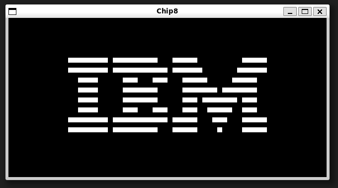

# Chip 8 Emulator/Interpreter

Install SDL2

Build with `cmake -S . -B build cmake --build build`

Run with `./build/chip8 {ROM-PATH}`

# Credits:

Tobias V.I Langhoff for the great guide 
https://tobiasvl.github.io/blog/write-a-chip-8-emulator/ 
https://github.com/tobiasvl

Test Roms from @Timendus  
https://github.com/Timendus/chip8-test-suite

Games from @Kripod
https://github.com/kripod/chip8-roms