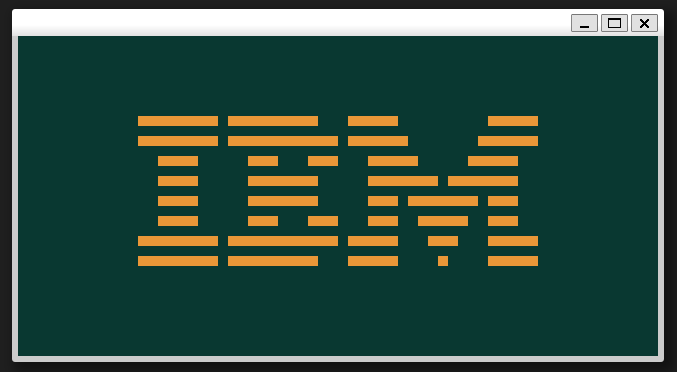
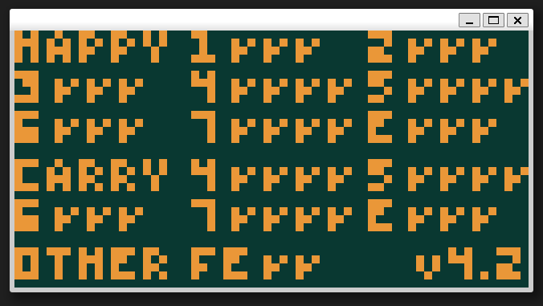
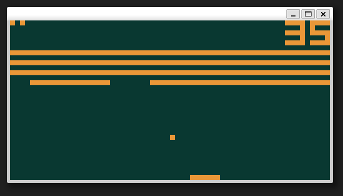
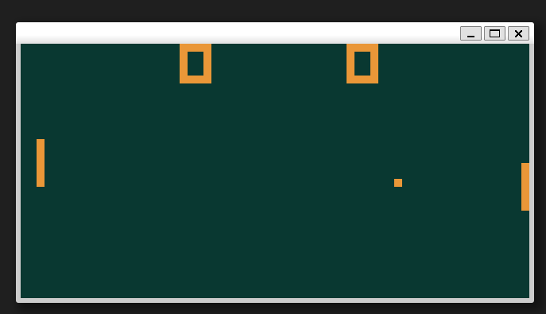

# Chip 8 Emulator/Interpreter

Chip8 implemented in C, using SDL2 library for handling the window and inputs.  
Few issues remain, flickering display when sprites in motion, collison detection is wonky.   
Built over ~10 days to learn basic emulation development and further low-level development knowledge without AI assistance, only online resources and my own brain.

 

# Build and Run

1. Install SDL2 
2. Build with `cmake -S . -B build && cmake --build build`  
3. Run with `./build/chip8 ./roms/{ROM-NAME}`

 

# Screenshots

# Credits:

Tobias V.I Langhoff for the great guide 
https://tobiasvl.github.io/blog/write-a-chip-8-emulator/ 
https://github.com/tobiasvl

Test Roms from @Timendus  
https://github.com/Timendus/chip8-test-suite

Games from @Kripod  
https://github.com/kripod/chip8-roms